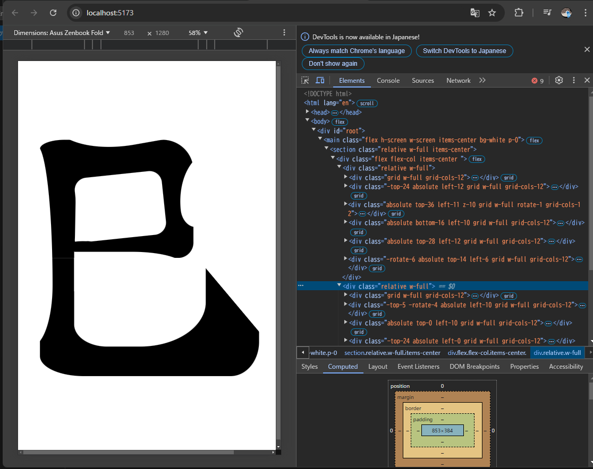

# kakizome
CSS書道部のふぐおが書き初めをするリポジトリです。  

## レギュレーション

- svgは使用禁止
- borderかbackground-colorを使用して文字を書く
- レスポンシブ対応は流石に辛すぎるので、chromeのディベロッパーツールのAsus Zenbook Foldのウインドウの大きさ(853x1280)を使用する。

## 作成した作品
### 2025年
巳  


## 動かし方
### 2025年
node.jsがインストールされていることが前提です。  

```bash
cd 2025
npm i
npm run dev
```

立ち上がったwebページにアクセスし、device toolbarでAsus Zenbook Foldのウインドウの大きさ(853x1280)にしてください。  
